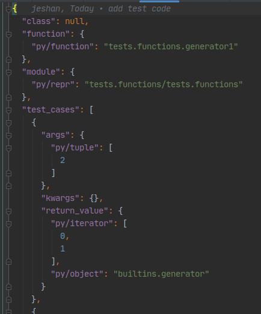
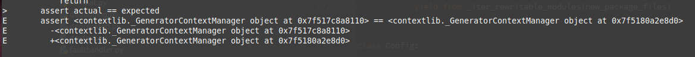

# pytest_cleanup
> Automated, comprehensive and well-organised pytest test cases.

Get started by typing `pip install pytest_cleanup`

# Description
> If we like to format our code with tools like Black, then why don't we do the same with our tests?

TLDR: `pytest_cleanup` runs your Python code and generates pytest tests out of it.

This will help you reach broad test coverage with real-world test cases.
Tests that are generated "just work", i.e they are clean, unaware of implementation details, and don't require active maintenance.

It even generates the (minimal) code that it requires to work; just 2 test functions (one for async and another for normal functions). These 2 are then parameterised with the [parametrize](https://docs.pytest.org/en/latest/parametrize.html) feature via `pytest_generate_tests`.

The data files are written with `jsonpickle` and look like this:



It's also possible to run it against an existing pytest test suite (see below).

In other words, it lets you do DDT for pytest (data-driven tests, development-driven testing, or both :nerd_face:)

# Why would you bother?

- save time by having tests generated for you :tada:
- dramatically increase test code coverage with little effort
- write more maintainable tests by separating code and data
- Too tedious/hard to generate custom data for your application? Run your code like you would in production and data files will be generated.
- helps you organise your test code consistently in new projects, or:
- replace your existing disorganised test code :+1:
- reduces handwritten setup code
- accelerate your migration to pytest; Since pytest supports existing nose and unittest, enable the recorder, run pytest and `pytest_cleanup` will generate clean tests for you.


> Note that tests that you write manually can still be kept or made to follow the same conventions as pytest_cleanup for consistency

# How it works

`pytest_cleanup` generates 3 files. These contain the minimal boilerplate required in your test (or current) directory:

```
2020-01-25 15:36:34.614 | DEBUG    | pytest_cleanup.constants:get_test_dir:18 - Will place test_pytestcleanup_cases.py under /app/test
2020-01-25 15:36:34.614 | INFO     | pytest_cleanup.recorder:__init__:252 - creating instance of recorder
2020-01-25 15:36:34.692 | DEBUG    | pytest_cleanup.recorder:save_example_scripts:159 - Saving example scripts (test_pytestcleanup_cases.py, conftest-pytest-cleanup-runtime.py, conftest-pytest-cleanup-record.py) under test
```

## test_pytestcleanup_cases.py

This will have the following 2 tests:
```python
import pytest

from pytest_cleanup.common import assert_return_values

def test_pytest_cleanup_sync_test_cases(fn, args, kwargs, expected):
    """See test/test-data directory for test cases"""
    actual = fn(*args, **kwargs)
    assert_return_values(actual, expected)


@pytest.mark.asyncio
async def test_pytest_cleanup_async_test_cases(fn, args, kwargs, expected):
    """See test/test-data directory for test cases.
    support for asyncio in pytest may be enabled by installing pytest-asyncio """
    actual = await fn(*args, **kwargs)
    assert_return_values(actual, expected)
```

## conftest-pytest-cleanup-runtime.py

The latter will be parametrized with the data files that will be generated later under `$your_test_directory/test-data`. This is achieved with snippet found with the also generated: `conftest-pytest-cleanup-runtime.py` (rename it to conftest.py or merge it with your existing conftest.py so that pytest can load it):

```python
def pytest_generate_tests(metafunc):
    from pytest_cleanup import parametrize_stg_tests

    parametrize_stg_tests(metafunc)

```


## conftest-pytest-cleanup-record.py (optional)

The third file that is generated is `conftest-pytest-cleanup-record.py`. You can use this one in case you want to use `pytest_cleanup` against an existing pytest test suite (see previous section on why you might want that):

> Again, rename it to conftest.py or merge it with your existing conftest.py so that pytest can load it

```python
from pytest_cleanup import Recorder


def pytest_runtestloop(session):
    Recorder().enter()


def pytest_sessionfinish(session, exitstatus):
    Recorder().exit()
```


# Usage
There are 3 ways to use `pytest_cleanup`:
## Basic usage
1. Record your tests `python -m pytest_cleanup your.module.path` (an importable module path, not file path!). This will attempt to call a no-arg function named `main` in the module specified. (Function name configurable; see [configuration](#configuration) section). `pytest_cleanup` will record function invocations and save them `$test_directory/test-data`.
2. Put generated `conftest-pytest-cleanup-runtime.py` into your conftest.py
3. Run pytest as you normally would.  It will load generated data by step 1 under `$test_directory/test-data` and dynamically generate test cases from it.
4. Confirm your test run passes.

## Use as a library
`pytest_cleanup` can also be used as a library for more flexibility. Otherwise, it's only needed as a test dependency.

```python
from pytest_cleanup import Recorder

with Recorder():
    your_custom_code_here()
```

Run pytest as explained in previous subsection.

> Note that the `Recorder` object is a singleton and invoking `Recorder()` multiple times has no effect.

## Using while running pytest
You can also run `pytest_cleanup` against an existing test suite:
1. `python -m pytest_cleanup`
2. Put generated `conftest-pytest-cleanup-record.py` into your conftest.py. (it has the functions `pytest_runtestloop` and `pytest_sessionfinish` to be able to record in pytest sessions)
3. Run pytest as you normally would
4. In conftest.py, replace `pytest_runtestloop` and `pytest_sessionfinish` functions by the contents of `conftest-pytest-cleanup-runtime.py` (which has the `pytest_generate_tests` function)

# Features
- Handles functions that return generators by automatically extending these into Python lists so that they can be asserted.
- Support for asyncio coroutines
- Supports nested (local) functions with `dill` library (appears as base64-encoded in the json files)
- Removes duplicate test cases (i.e identical arguments that return identical return values)

# Example projects
## botostubs
The [botostubs](https://github.com/jeshan/botostubs) (by yours truly) went from 0 to 71% adopting pytest_cleanup:
```
-- Docs: https://docs.pytest.org/en/latest/warnings.html

---------- coverage: platform linux, python 3.6.10-final-0 -----------
Name      Stmts   Miss  Cover   Missing
---------------------------------------
main.py     208     60    71%   93, 133, 161, 179-184, 191, 199-210, 214-248, 296-297, 305-310, 314-316, 320-322, 326
```

This project helped itself during development :grin:. See the [Dockerfile](Dockerfile) for details.


# Notes
- Running over and over write test cases in new files to avoid overwriting your previous test cases. The filenames are appended with -00, -01, ... for up to 10 files.
- It works well if your functions are [deterministic](https://en.wikipedia.org/wiki/Deterministic_algorithm) (e.g pure).
> If not, then you should probably make them so!
- If your function arguments are not serialisable, then test cases won't be generated. You will see an error in the logs for that function.
- This project uses pickling (with jsonpickle or dill) to load the test data. If you're the one generated test data, then it should be fine loading it during tests. Otherwise, don't load untrusted test data. 

# Configuration
`pytest_cleanup` is configurable exclusively via environment variables:

- `PYTESTCLEANUP_LOG_LEVEL`: Set to DEBUG to investigate/report issues.
- `PYTESTCLEANUP_TEST_DATA_DIRECTORY`: Change it the default (`test-data`) is inconvenient.
- `PYTESTCLEANUP_TEST_DIRECTORY`: Specify your test directory explicitly. By default, will check in order: `test`, `tests`, `testing`, or otherwise assumes the current directory.
- `PYTESTCLEANUP_FUNCTION`: If you invoke `python -m pytest_cleanup your.module`, it will invoke its no-arg `main` by default. Set this env var to change it.
- `PYTESTCLEANUP_TEST_CASE_COUNT_PER_FUNCTION`: By default, will record 5 test cases per function. 
- `PYTESTCLEANUP_SERIALISATION_DEPTH`: Decrease it in case you get a maximum recursion depth exception while deserialising. Default 500.
- `PYTESTCLEANUP_FILESIZE_LIMIT_MB`: Limit the json content size. Useful if you don't want to get big test data files. Default: 5 MB.
- `PYTESTCLEANUP_INCLUDE_MODULES`: Force include certain modules from consideration. Some modules are excluded by default (those installed in the virtualenv, built-in functions and other system packages). Accepts wildcard patterns via [fnmatch](https://docs.python.org/3/library/fnmatch.html) Takes precedence over `PYTESTCLEANUP_EXCLUDE_MODULES`.
- `PYTESTCLEANUP_EXCLUDE_MODULES`: Force exclude certain modules from consideration.
- `PYTESTCLEANUP_ALLOW_ALL_MODULES`: Force considers all modules. **Warning**: slow!

# TODO
- Minor issue: functions in your main module may be loaded twice, creating identical test cases twice for that function. (maybe happening only in this project)
- Handle test suites that are run in `tox`. The test files generated are in tox's virtualenv temp directory and we need a way to get them out of it so that tox can use them in subsequent runs.

## Ideas
- Since we now have example test cases, we could increase their value by generating property-based tests out of them with [Hypothesis](https://hypothesis.readthedocs.io/en/latest/). If anybody is interested in picking this up, let me know.

# What if you have test failures?
> It may be due to a bug in pytest_cleanup but it's probably because it's difficult to serialise all data types, e.g file descriptors.

## Cases that you should handle on your own
- Problem: Assertion does not work properly on your objects
> Solution: You should define an `__eq__` function in your class. This will ensure that pytest asserts the return values properly.



## How to report in issue
1. Raise an issue [here](https://github.com/jeshan/pytest_cleanup/issues/new) about the test failure (or upvote an existing one)
2. Paste your function code (or its signature)
3. Paste the json file that `pytest_cleanup` generated, e.g `test-data/path/to/function/01.json`
4. State what you were expecting
5. State what happened instead

# Release process
Deployment pipeline described in [templates/deployment-pipeline.yaml](templates/deployment-pipeline.yaml).

Project can also be released with:
- `docker-compose run release` : Enter password when prompted


# Acknowledgements
Thanks to the following projects for making this possible:
- jsonpickle
- dill

But also huge thanks to the pytest team for making the most exciting test framework that I've ever seen.
Other libraries used:
- flit (packaging and deployment to PyPI)
- loguru (logging)
- pytest plugins like pytest-progress, pytest-asyncio, pytest-randomly, pytest-cov
- sceptre (for deploying to aws)


# Related
These projects resemble this one but mine requires much less effort on your part and generates even less boilerplate :+1:
- https://smarie.github.io/python-pytest-cases/
- https://github.com/Figglewatts/pytestgen


# Copyright
Copyright 2020. Jeshan G. BABOOA
Released under the MIT licence. See file named [LICENCE](LICENCE) for details.

